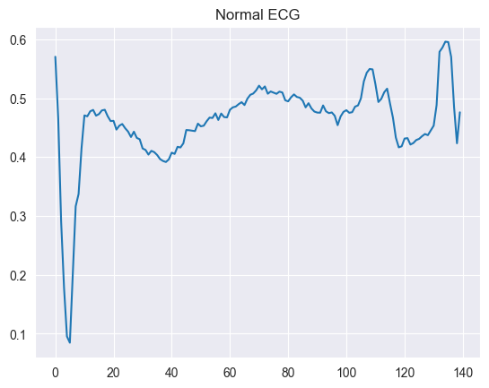
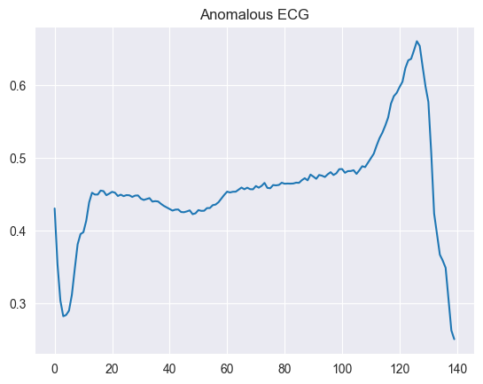
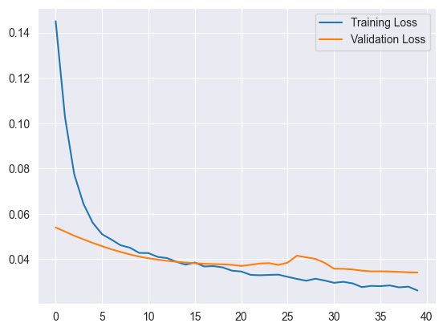
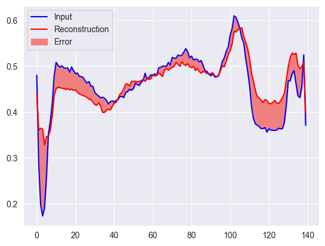
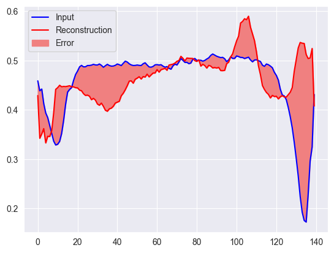
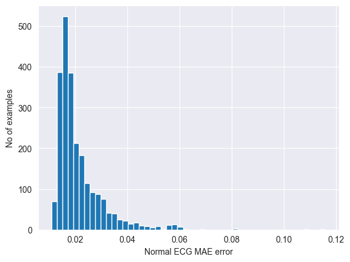
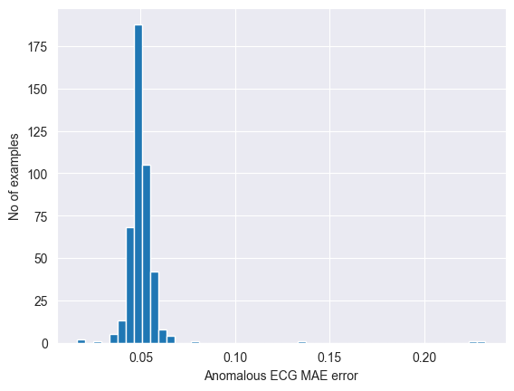
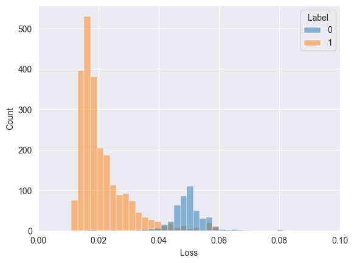
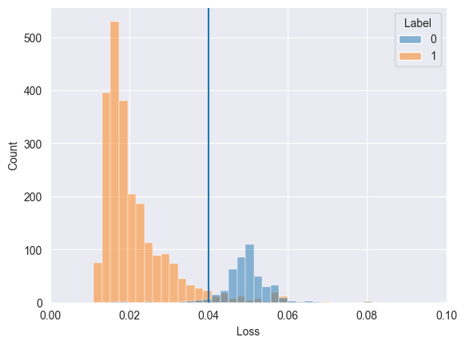
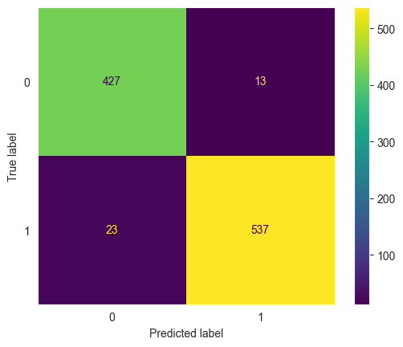

# Introduction to Autoencoder

An Autoencoder is a widely used neural network architecture in deep learning for tasks such as dimensionality reduction, data compression, and anomaly detection. It's a type of unsupervised neural network that has the ability to learn effective representations of input data by discovering patterns and important features within the data. An interesting application of Autoencoders is in anomaly detection, where they can be trained to reconstruct normal data and then identify anomalies based on the difference between input data and the reconstruction.


# Components of an Autoencoder
The Autoencoder consists of three main components:

Encoder:

1. The **encoder** is the part of the neural network responsible for transforming input data into a lower-dimensional latent representation. It performs data compression by capturing important features.
Latent Space:

2. The **latent space** is where the lower-dimensional representation is held. This representation contains essential information about the input data and is the central point of the Autoencoder.
Decoder:

3. The **decoder** is responsible for reconstructing the data from the latent representation. It tries to generate an output that is a close reconstruction of the original input data.

<p align="center">
    
    <p align="center">AutoEncoder Architecture</p>
</p>

# Anomaly Detection with Autoencoder
To detect anomalies using an Autoencoder, the general procedure is as follows:

1. Train the Autoencoder with normal data, i.e., data that does not contain anomalies.

2. Use the trained Autoencoder to reconstruct the input data.

3. Calculate the difference between the input data and the reconstructions.

4. Set a threshold for this difference. Any input that has a difference above this threshold is considered an anomaly.

# Advantages of Autoencoders in Anomaly Detection

* Autoencoders are capable of capturing complex and nonlinear patterns in data, making them effective for detecting anomalies.

* It is an unsupervised approach, meaning it does not require anomaly labels in the training dataset, making it useful when anomalous data is rare or unknown.

* The flexibility of Autoencoders allows adaptation to different types of data and anomaly detection tasks.


```python
import numpy as np
import pandas as pd
import tensorflow as tf
import seaborn as sns
import matplotlib.pyplot as plt
from sklearn.model_selection import train_test_split
from sklearn.metrics import accuracy_score, precision_score, recall_score, f1_score, confusion_matrix, ConfusionMatrixDisplay

from tensorflow.keras.layers import (
    ReLU,
    Dense,
    Activation,
    BatchNormalization,
)

sns.set_style("darkgrid")
```


```python
import warnings
warnings.filterwarnings("ignore", "is_categorical_dtype")
warnings.filterwarnings("ignore", "use_inf_as_na")
```


```python
# Download the dataset

df = pd.read_csv('http://storage.googleapis.com/download.tensorflow.org/data/ecg.csv', header=None)
raw_data = df.values

df.head()

```


<div>
<style scoped>
    .dataframe tbody tr th:only-of-type {
        vertical-align: middle;
    }

    .dataframe tbody tr th {
        vertical-align: top;
    }

    .dataframe thead th {
        text-align: right;
    }
</style>
<table border="1" class="dataframe">
  <thead>
    <tr style="text-align: right;">
      <th></th>
      <th>0</th>
      <th>1</th>
      <th>2</th>
      <th>3</th>
      <th>4</th>
      <th>5</th>
      <th>6</th>
      <th>7</th>
      <th>8</th>
      <th>9</th>
      <th>...</th>
      <th>131</th>
      <th>132</th>
      <th>133</th>
      <th>134</th>
      <th>135</th>
      <th>136</th>
      <th>137</th>
      <th>138</th>
      <th>139</th>
      <th>140</th>
    </tr>
  </thead>
  <tbody>
    <tr>
      <th>0</th>
      <td>-0.112522</td>
      <td>-2.827204</td>
      <td>-3.773897</td>
      <td>-4.349751</td>
      <td>-4.376041</td>
      <td>-3.474986</td>
      <td>-2.181408</td>
      <td>-1.818286</td>
      <td>-1.250522</td>
      <td>-0.477492</td>
      <td>...</td>
      <td>0.792168</td>
      <td>0.933541</td>
      <td>0.796958</td>
      <td>0.578621</td>
      <td>0.257740</td>
      <td>0.228077</td>
      <td>0.123431</td>
      <td>0.925286</td>
      <td>0.193137</td>
      <td>1.0</td>
    </tr>
    <tr>
      <th>1</th>
      <td>-1.100878</td>
      <td>-3.996840</td>
      <td>-4.285843</td>
      <td>-4.506579</td>
      <td>-4.022377</td>
      <td>-3.234368</td>
      <td>-1.566126</td>
      <td>-0.992258</td>
      <td>-0.754680</td>
      <td>0.042321</td>
      <td>...</td>
      <td>0.538356</td>
      <td>0.656881</td>
      <td>0.787490</td>
      <td>0.724046</td>
      <td>0.555784</td>
      <td>0.476333</td>
      <td>0.773820</td>
      <td>1.119621</td>
      <td>-1.436250</td>
      <td>1.0</td>
    </tr>
    <tr>
      <th>2</th>
      <td>-0.567088</td>
      <td>-2.593450</td>
      <td>-3.874230</td>
      <td>-4.584095</td>
      <td>-4.187449</td>
      <td>-3.151462</td>
      <td>-1.742940</td>
      <td>-1.490659</td>
      <td>-1.183580</td>
      <td>-0.394229</td>
      <td>...</td>
      <td>0.886073</td>
      <td>0.531452</td>
      <td>0.311377</td>
      <td>-0.021919</td>
      <td>-0.713683</td>
      <td>-0.532197</td>
      <td>0.321097</td>
      <td>0.904227</td>
      <td>-0.421797</td>
      <td>1.0</td>
    </tr>
    <tr>
      <th>3</th>
      <td>0.490473</td>
      <td>-1.914407</td>
      <td>-3.616364</td>
      <td>-4.318823</td>
      <td>-4.268016</td>
      <td>-3.881110</td>
      <td>-2.993280</td>
      <td>-1.671131</td>
      <td>-1.333884</td>
      <td>-0.965629</td>
      <td>...</td>
      <td>0.350816</td>
      <td>0.499111</td>
      <td>0.600345</td>
      <td>0.842069</td>
      <td>0.952074</td>
      <td>0.990133</td>
      <td>1.086798</td>
      <td>1.403011</td>
      <td>-0.383564</td>
      <td>1.0</td>
    </tr>
    <tr>
      <th>4</th>
      <td>0.800232</td>
      <td>-0.874252</td>
      <td>-2.384761</td>
      <td>-3.973292</td>
      <td>-4.338224</td>
      <td>-3.802422</td>
      <td>-2.534510</td>
      <td>-1.783423</td>
      <td>-1.594450</td>
      <td>-0.753199</td>
      <td>...</td>
      <td>1.148884</td>
      <td>0.958434</td>
      <td>1.059025</td>
      <td>1.371682</td>
      <td>1.277392</td>
      <td>0.960304</td>
      <td>0.971020</td>
      <td>1.614392</td>
      <td>1.421456</td>
      <td>1.0</td>
    </tr>
  </tbody>
</table>
<p>5 rows × 141 columns</p>
</div>


```python
# The labels are in the last column
labels = raw_data[:, -1]

# The ECG data
data = raw_data[:, 0:-1]

# Split the data
train_data, test_data, train_labels, test_labels = train_test_split(
    data, labels, test_size=0.2, random_state=21
)
```


```python
# Normalize data (values between 0, 1)
min_val = tf.reduce_min(train_data)
max_val = tf.reduce_max(train_data)

train_data = (train_data - min_val) / (max_val - min_val)
test_data = (test_data - min_val) / (max_val - min_val)

train_data = tf.cast(train_data, tf.float32)
test_data = tf.cast(test_data, tf.float32)
```


```python
# Separete data into Normal data and Anomalous Data (Because the model is training only on Normal data)
train_labels = train_labels.astype(bool)
test_labels = test_labels.astype(bool)

normal_train_data = train_data[train_labels]
normal_test_data = test_data[test_labels]

anomalous_train_data = train_data[~train_labels]
anomalous_test_data = test_data[~test_labels]
```


```python
# Plot Normal ECG Data
sns.lineplot(normal_train_data[0])
plt.title("Normal ECG")
plt.show()
```


    

    


```python
# Plot Anomalous ECG Data
sns.lineplot(anomalous_train_data[0])
plt.title("Anomalous ECG")
plt.show()
```


    

    


### Building the model


```python
class AnomalyDetector(tf.keras.Model):
    def __init__(self):
        super(AnomalyDetector, self).__init__()

        self.encoder = self.get_encoder()
        self.decoder = self.get_decoder()

    def get_encoder(self):
        """Return the encoder arch"""
        encoder = tf.keras.models.Sequential([

            Dense(32),
            BatchNormalization(),
            ReLU(),

            Dense(16),
            BatchNormalization(),
            ReLU(),

            Dense(8),
            BatchNormalization(),
            ReLU(),
        ])
        return encoder
    
    def get_decoder(self):
        decoder = tf.keras.models.Sequential([
            Dense(16),
            BatchNormalization(),
            ReLU(),

            Dense(32),
            BatchNormalization(),
            ReLU(),

            Dense(64),
            BatchNormalization(),
            ReLU(),

            Dense(140),
            BatchNormalization(),
            Activation("sigmoid")
        ])
        return decoder
    
    def call(self, ecp_inp):
        encoder = self.encoder(ecp_inp)
        decoder = self.decoder(encoder)
        return decoder
```

### Training the Model


```python
autoencoder = AnomalyDetector()
autoencoder.compile(optimizer='adam', loss='mae')
```


```python

history = autoencoder.fit(normal_train_data, normal_train_data, 
          epochs=40, 
          batch_size=256,
          validation_data=(test_data, test_data),
          shuffle=True,)
```

    Epoch 1/40
    10/10 [==============================] - 3s 29ms/step - loss: 0.1450 - val_loss: 0.0540
    Epoch 2/40
    10/10 [==============================] - 0s 6ms/step - loss: 0.1027 - val_loss: 0.0522
    Epoch 3/40
    10/10 [==============================] - 0s 6ms/step - loss: 0.0775 - val_loss: 0.0504
    Epoch 4/40
    10/10 [==============================] - 0s 7ms/step - loss: 0.0644 - val_loss: 0.0487
    Epoch 5/40
    10/10 [==============================] - 0s 6ms/step - loss: 0.0560 - val_loss: 0.0472
    Epoch 6/40
    10/10 [==============================] - 0s 6ms/step - loss: 0.0510 - val_loss: 0.0457
    Epoch 7/40
    10/10 [==============================] - 0s 6ms/step - loss: 0.0487 - val_loss: 0.0444
    Epoch 8/40
    10/10 [==============================] - 0s 6ms/step - loss: 0.0461 - val_loss: 0.0432
    Epoch 9/40
    10/10 [==============================] - 0s 6ms/step - loss: 0.0451 - val_loss: 0.0421
    Epoch 10/40
    10/10 [==============================] - 0s 6ms/step - loss: 0.0428 - val_loss: 0.0411
    Epoch 11/40
    10/10 [==============================] - 0s 6ms/step - loss: 0.0427 - val_loss: 0.0404
    Epoch 12/40
    10/10 [==============================] - 0s 6ms/step - loss: 0.0410 - val_loss: 0.0398
    Epoch 13/40
    10/10 [==============================] - 0s 6ms/step - loss: 0.0405 - val_loss: 0.0393
    Epoch 14/40
    10/10 [==============================] - 0s 6ms/step - loss: 0.0389 - val_loss: 0.0389
    Epoch 15/40
    10/10 [==============================] - 0s 7ms/step - loss: 0.0376 - val_loss: 0.0385
    Epoch 16/40
    10/10 [==============================] - 0s 6ms/step - loss: 0.0385 - val_loss: 0.0382
    Epoch 17/40
    10/10 [==============================] - 0s 6ms/step - loss: 0.0368 - val_loss: 0.0380
    Epoch 18/40
    10/10 [==============================] - 0s 6ms/step - loss: 0.0369 - val_loss: 0.0378
    Epoch 19/40
    10/10 [==============================] - 0s 6ms/step - loss: 0.0364 - val_loss: 0.0377
    Epoch 20/40
    10/10 [==============================] - 0s 6ms/step - loss: 0.0349 - val_loss: 0.0375
    Epoch 21/40
    10/10 [==============================] - 0s 7ms/step - loss: 0.0346 - val_loss: 0.0370
    Epoch 22/40
    10/10 [==============================] - 0s 6ms/step - loss: 0.0331 - val_loss: 0.0375
    Epoch 23/40
    10/10 [==============================] - 0s 6ms/step - loss: 0.0329 - val_loss: 0.0381
    Epoch 24/40
    10/10 [==============================] - 0s 7ms/step - loss: 0.0331 - val_loss: 0.0383
    Epoch 25/40
    10/10 [==============================] - 0s 6ms/step - loss: 0.0332 - val_loss: 0.0375
    Epoch 26/40
    10/10 [==============================] - 0s 6ms/step - loss: 0.0322 - val_loss: 0.0385
    Epoch 27/40
    10/10 [==============================] - 0s 6ms/step - loss: 0.0313 - val_loss: 0.0415
    Epoch 28/40
    10/10 [==============================] - 0s 6ms/step - loss: 0.0305 - val_loss: 0.0408
    Epoch 29/40
    10/10 [==============================] - 0s 6ms/step - loss: 0.0314 - val_loss: 0.0401
    Epoch 30/40
    10/10 [==============================] - 0s 6ms/step - loss: 0.0306 - val_loss: 0.0384
    Epoch 31/40
    10/10 [==============================] - 0s 6ms/step - loss: 0.0296 - val_loss: 0.0358
    Epoch 32/40
    10/10 [==============================] - 0s 6ms/step - loss: 0.0300 - val_loss: 0.0358
    Epoch 33/40
    10/10 [==============================] - 0s 6ms/step - loss: 0.0293 - val_loss: 0.0355
    Epoch 34/40
    10/10 [==============================] - 0s 6ms/step - loss: 0.0277 - val_loss: 0.0349
    Epoch 35/40
    10/10 [==============================] - 0s 6ms/step - loss: 0.0282 - val_loss: 0.0346
    Epoch 36/40
    10/10 [==============================] - 0s 6ms/step - loss: 0.0281 - val_loss: 0.0347
    Epoch 37/40
    10/10 [==============================] - 0s 6ms/step - loss: 0.0284 - val_loss: 0.0346
    Epoch 38/40
    10/10 [==============================] - 0s 6ms/step - loss: 0.0276 - val_loss: 0.0344
    Epoch 39/40
    10/10 [==============================] - 0s 6ms/step - loss: 0.0279 - val_loss: 0.0342
    Epoch 40/40
    10/10 [==============================] - 0s 7ms/step - loss: 0.0262 - val_loss: 0.0341


```python
plt.plot(history.history["loss"], label="Training Loss")
plt.plot(history.history["val_loss"], label="Validation Loss")
plt.legend()
```


    <matplotlib.legend.Legend at 0x17cfc349a50>


    

    


### Evaluating


```python
encoded_data = autoencoder.encoder(normal_test_data).numpy()
decoded_data = autoencoder.decoder(encoded_data).numpy()

plt.plot(normal_test_data[0], 'b')
plt.plot(decoded_data[0], 'r')
plt.fill_between(np.arange(140), decoded_data[0], normal_test_data[0], color='lightcoral')
plt.legend(labels=["Input", "Reconstruction", "Error"])
plt.show()


```


    

    


```python
encoded_data = autoencoder.encoder(anomalous_test_data).numpy()
decoded_data = autoencoder.decoder(encoded_data).numpy()

plt.plot(anomalous_test_data[1], 'b')
plt.plot(decoded_data[1], 'r')
plt.fill_between(np.arange(140), decoded_data[1], anomalous_test_data[1], color='lightcoral')
plt.legend(labels=["Input", "Reconstruction", "Error"])
plt.show()

```


    

    


### Defining a Threshold


```python
losses = []
labels = []

reconstructions = autoencoder.predict(normal_train_data)
normal_loss = tf.keras.losses.mae(reconstructions, normal_train_data)

[losses.append(i) for i in normal_loss.numpy()]
[labels.append(1) for _ in normal_loss.numpy()]

plt.hist(normal_loss[None,:], bins=50)
plt.xlabel("Normal ECG MAE error")
plt.ylabel("No of examples")
plt.show()

```

    74/74 [==============================] - 0s 951us/step


    

    


```python
reconstructions = autoencoder.predict(anomalous_test_data)
anomalous_loss = tf.keras.losses.mae(reconstructions, anomalous_test_data)

[losses.append(i) for i in anomalous_loss.numpy()]
[labels.append(0) for _ in anomalous_loss.numpy()]

plt.hist(anomalous_loss[None, :], bins=50)
plt.xlabel("Anomalous ECG MAE error")
plt.ylabel("No of examples")
plt.show()

```

    14/14 [==============================] - 0s 2ms/step


    

    


```python
hist_data = pd.DataFrame({"Loss":losses, "Label":labels})
sns.histplot(data=hist_data, x="Loss", hue="Label")
plt.xlim(0, 0.1)
```


    (0.0, 0.1)


    

    


```python
sns.histplot(data=hist_data, x="Loss", hue="Label")
plt.xlim(0, 0.1)
threshold = 0.04
plt.axvline(threshold)
```


    <matplotlib.lines.Line2D at 0x17cfcd2fb20>


    

    


```python
def predict(model, data, threshold):
  reconstructions = model(data)
  loss = tf.keras.losses.mae(reconstructions, data)
  return tf.math.less(loss, threshold)

def print_stats(predictions, labels):
  print(f"Accuracy = {round(accuracy_score(labels, predictions),3)}")
  print(f"Precision = {round(precision_score(labels, predictions),3)}")
  print(f"Recall = {round(recall_score(labels, predictions),3)}")
  print(f"F1-Score = {round(f1_score(labels, predictions),3)}")
  
  cm = confusion_matrix(labels, predictions)
  disp = ConfusionMatrixDisplay(cm)
  disp.plot()
  plt.grid(False)

preds = predict(autoencoder, test_data, threshold)
print_stats(preds, test_labels)

```

    Accuracy = 0.964
    Precision = 0.976
    Recall = 0.959
    F1-Score = 0.968


    

    

